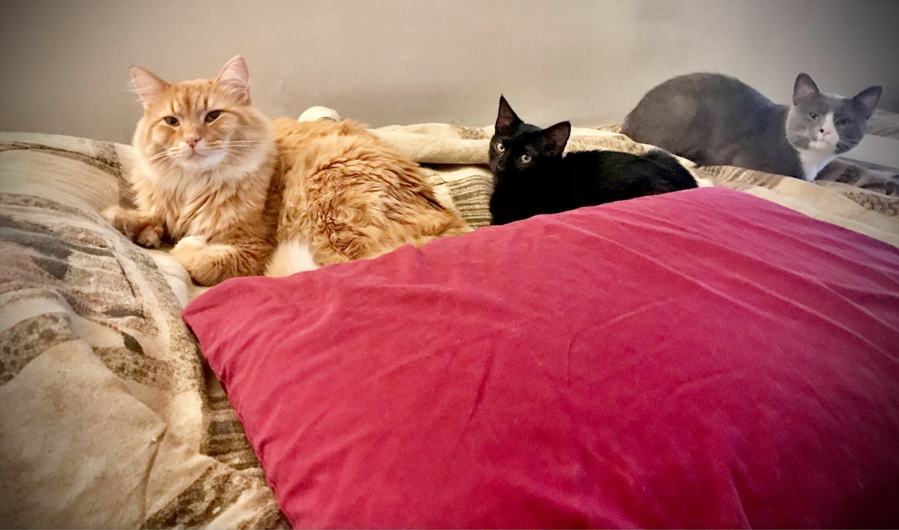

# Dakota's Blog

### Was your first week what you expected? Why? Why not?

* My first week was exactly what I expected. I knew coming into this that it would be a challenge, and that's what it was from the start. 
* I didn't realize Git/Github/ClI would be so complex, but with practice it is definitely getting easier!

---

### What are you excited or eager to learn more about?
* I'm definitely excited to fine tune my skills in the git-flow work strategy, and learn more about how a team works together within a company.
* Best coding practices! 
* Javascript and CSS and their frameworks.
* Developer culture.

---

### What is something about you that can only be learned by reading this blog?
* I've spent the last 18 years of my life playing the same video game. (Runescape)
* Me and my fiance have adopted 3 cats in the past 8 months. Look how cute!


---

### CSS Syntax for button changing color on hover:
``` 
button:hover {
    background-color: blue;
}
```

----

### What is something you wish you could do but currently do not have the coding skills to accomplish?
* I wish I could build UI/UX pleasing applications. 
* I wish I could do more of the codewars/leetcode JS problem sets. 

### What are you struggling with?
* The only thing I am really struggling with currently is focusing too much on the end goal. I tend to psych myself out by thinking of all the languages/frameworks we will be learning. I need to just focus more on whats directly in front of me and take it day by day/week by week.

### How do you solve a problem?
* To solve a problem I usually:
    1. Identify the cause of the problem.
    2. Identify possible solutions.
    3. Evaluate and choose the best solution.
    4. Try the solution I chose.
    5. Test and repeat if solution didn't solve the problem correctly. 
    
### What methods do you use to help yourself get unstuck?
* To help myself get unstuck I usually take a breather and step away from my computer.
* Go outside and get some fresh air and try to think through the problem I am facing. 


